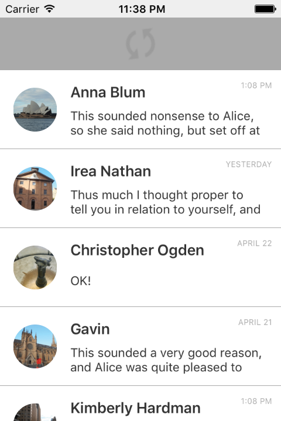
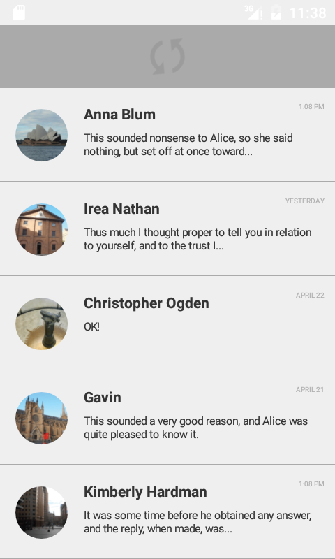
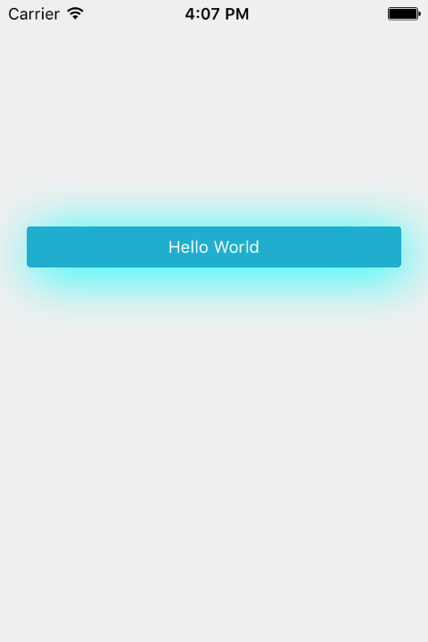
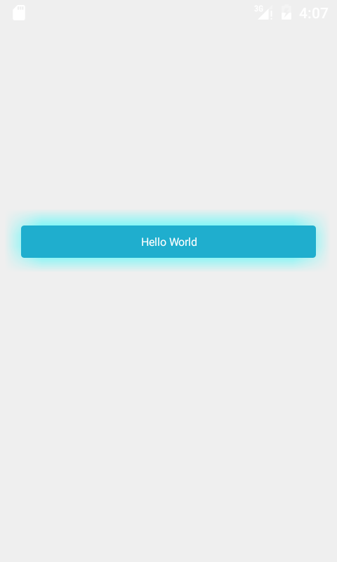
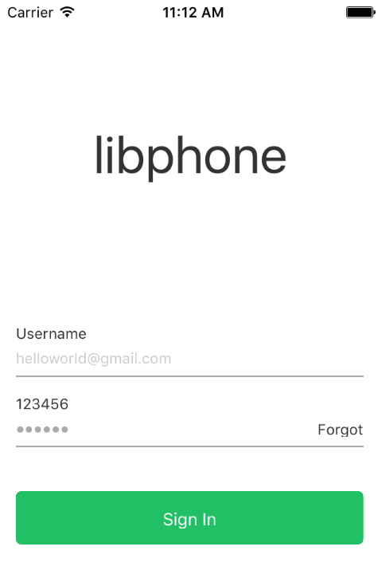
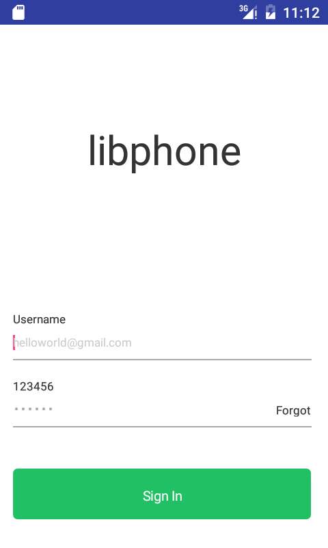
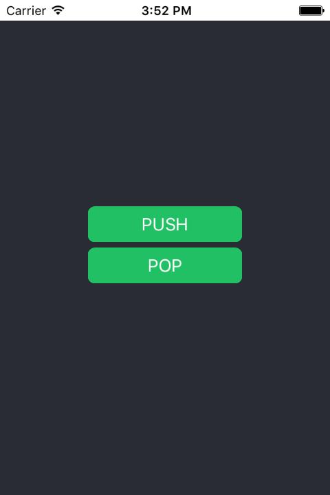
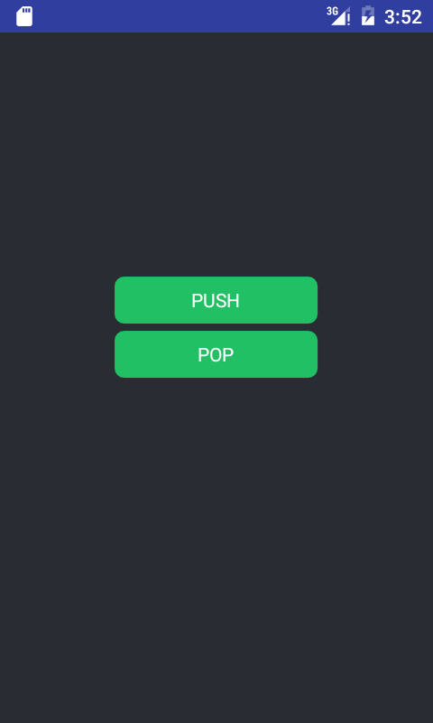

Overview
-------------
libphone is a cross-platform library which supports iOS and Android development in C language, with a focus on a core set features.

Code once, target both.

*Note: This project is still in the very early stage, **NOT** suggest used in product environment, because the api is not stable and may be changed in the future. The beta version will be released in a few weeks, from that point, the api will be stable.*

Quick Start
-------------
libphone is not an IDE, so it's still a requirement that following the official guide to install `Xcode` or `Android Studio`(including the jni supports). After doing that, then
- iOS
  - Create a new Xcode project(Single View Application with all default options)
  - Remove all auto generated files except main.m and Info.plist
  - Replace the whole content inside `main.m` with the following:  

    ```objc
    #import "libphone.h"

    @interface iOSAppDelegate : phoneAppDelegate
    @end

    @implementation iOSAppDelegate
    @end

    int main(int argc, char * argv[]) {
      @autoreleasepool {
        return UIApplicationMain(argc, argv, nil, NSStringFromClass([iOSAppDelegate class]));
      }
    }
    ```
  - Remove the `Main storyboard file base name` key in Info.plist
  - Drag the following files to Xcode:

    ```
    src/libphone.c
    src/ios/iosphone.m
    samples/helloworld/helloworld.c
    ```
  - Change Build Settings
    - Header Search Paths `<REPLACE WITH REAL PATH>/libphone/include <REPLACE WITH REAL PATH>/libphone/src`
  - Run and and enjoy!

- Android
  - Create a new project(With Empty Activity and all default options)
  - Modify `classpath` inside build.grade (Project: &lt;YOUR PROJECT NAME&gt;)
    ```
    classpath 'com.android.tools.build:gradle-experimental:0.7.2'
    ```
  - Modify build.grade (Module: app) according to the following example:
    ```gradle
    apply plugin: 'com.android.model.application'

    model {
        android {
            compileSdkVersion 23
            buildToolsVersion "23.0.3"

            defaultConfig {
                applicationId "com.example.jeremy.test"
                minSdkVersion.apiLevel 15
                targetSdkVersion.apiLevel 23
                versionCode 1
                versionName "1.0"
            }
            buildTypes {
                release {
                    minifyEnabled false
                    //proguardFiles getDefaultProguardFile('proguard-android.txt'), 'proguard-rules.pro'
                    proguardFiles.add(file('proguard-android.txt'))
                }
            }
        }

        android.ndk {
            moduleName "libphone"
            CFlags.add("-I/Users/jeremy/Repositories/libphone/include")
            CFlags.add("-I/Users/jeremy/Repositories/libphone/src")
            CFlags.add("-I/Users/jeremy/Repositories/libphone/samples/ratchet")
            ldLibs.add("log")
        }

        android.sources.main {
            java.source.srcDirs = ["src/main/java", "/Users/jeremy/Repositories/libphone/src/android/java"]
            jni.source.srcDirs = ["/Users/jeremy/Repositories/libphone/src/android/jni",
                                  "/Users/jeremy/Repositories/libphone/src",
                                  "/Users/jeremy/Repositories/libphone/samples/helloworld"]
        }
    }

    dependencies {
        compile fileTree(dir: 'libs', include: ['*.jar'])
        testCompile 'junit:junit:4.12'
        compile 'com.android.support:appcompat-v7:23.4.0'
    }
    ```
  - Modify MainActivity.java  

    ```java
    package <YOUR PACKET NAME>;

    import android.support.v7.app.AppCompatActivity;
    import android.os.Bundle;
    import com.libphone.PhoneActivity;

    public class MainActivity extends PhoneActivity {
        static {
            System.loadLibrary("libphone");
        }

        @Override
        protected void onCreate(Bundle savedInstanceState) {
            super.onCreate(savedInstanceState);
        }
    }
    ```
  - Run 'app' and have fun!


Screenshoots
-----------------

  


  


  


  

Features
-------------
- View
  - Corner Radius
  - Border
  - Shadow
  - Animation
  - Alpha
  - Rotate
  - Pull to Refresh
- Work Queue
- Timer  

*(More functions are under heavy development.)*

Tools
-----------
**tools/phoneres.py**  
Generate different kinds of specific image resources which required by both platforms automatically.

**tools/phonelayout.py**   
Generate C codes for view layout based on xml

Contributing
----------------
Don't hesitate to make a pull request or post some ideas on *[trello](https://trello.com/b/y46Ve05Y)*.  All kinds of contribution are welcome.  
*Note: Please just follow the coding style of the existed codes.*
